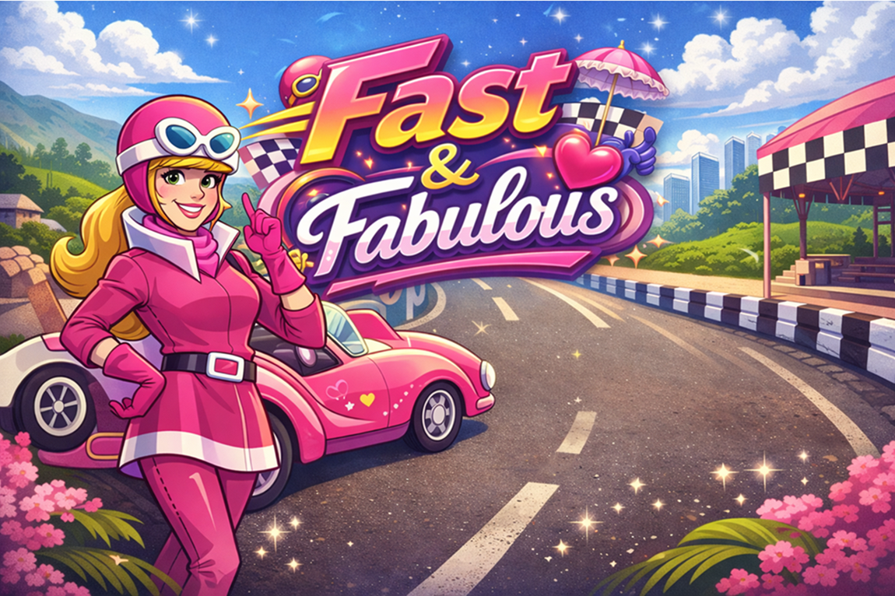

# 💖 Fast & Fabulous



---

## 👩‍💻 Desenvolvedora
Julia Monteiro  

## 👨‍🏫 Product Owner
Carlos Roberto da Silva Filho  

---

## 🎮 Visão Geral do Sistema

### 📌 Descrição
Fast & Fabulous é um jogo de corrida 2D desenvolvido com **HTML, CSS e JavaScript**, utilizando a **Canvas API** para renderização gráfica.

O jogo oferece uma experiência dinâmica onde é possível jogar sozinho ou com dois jogadores simultaneamente em uma pista estilizada, desviando de obstáculos e coletando itens ao longo das fases.

---

### 🎯 Objetivo
Sobreviver às três fases do jogo, desviando dos inimigos, coletando itens e acumulando pontos até alcançar a vitória final.

---

### 🎨 Tema
O jogo possui um estilo visual inspirado na **Penélope Charmosa** e no desenho **Corrida Maluca**, com estética clean, moderna e vibrante, utilizando tons de rosa, lilás e elementos visuais do universo de corrida.

---

## 🕹️ Instruções de Jogabilidade

### 🎮 Controles

👑 **Modo 1 Player (Penélope)**  
W → subir  

S → descer  

👑 **Modo 2 Players**

👑 Jogadora 1 (Penélope) 

W → subir  

S → descer  

💜 Jogadora 2 (Violeta)  

↑ → subir  

↓ → descer  

---

### 🎯 Objetivo do jogador

- Desviar dos carros inimigos  

- Coletar itens ao longo da pista  

- Sobreviver até a fase final  

- Completar as 3 fases do jogo  

---

### 💡 Coletáveis

💎 Diamante → aumenta a pontuação  

💖 Coração → recupera vidas  

---

## ⚙️ Especificações Técnicas

O projeto foi desenvolvido utilizando:

- Programação Orientada a Objetos (POO)  

- Canvas API para renderização  

- requestAnimationFrame para animação 

- Sistema de colisão  

- Manipulação de eventos do teclado  

---

## 🧠 Mecânicas do Jogo

- Movimento dos jogadores  

- Sistema de colisão  

- Sistema de vidas  

- Sistema de pontuação  

- Coletáveis (power-ups)  

- Progressão por fases  

- Aumento de dificuldade  

- Tela de vitória e Game Over  

---

## 🏁 Regras de Negócio

RN01 – O jogo possui três fases progressivas  

RN02 – A velocidade dos inimigos aumenta conforme a fase  

RN03 – Cada jogador possui até 5 vidas  

RN04 – O jogador perde vida ao colidir com inimigos  

RN05 – O jogador recupera vida ao coletar coração  

RN06 – O jogador ganha pontos ao coletar diamantes  

RN07 – A troca de fase ocorre automaticamente conforme a pontuação  

RN08 – O jogo termina quando:

- No modo 1 jogador: o jogador perde todas as vidas  

- No modo 2 jogadores: ambos os jogadores perdem todas as vidas 

- ou quando apenas um jogador permanece com vida  

RN09 – Condições de vitória:

- No modo 1 jogador: alcançar a fase final com pelo menos 1 vida  

- No modo 2 jogadores: vencer ao alcançar a fase final primeiro ou permanecer com vida quando o outro jogador for eliminado  

---

## 📋 Requisitos Funcionais

RF01 – Movimentação dos jogadores nos eixos verticais  

RF02 – Detecção de colisão com inimigos  

RF03 – Sistema de vidas  

RF04 – Sistema de pontuação  

RF05 – Sistema de coleta de itens  

RF06 – Progressão automática entre fases  

RF07 – Exibição de HUD (vidas, pontos e fase)  

RF08 – Interface com telas:

- Menu inicial  

- Jogo  

- Como Jogar  

- Sobre  

- Vitória  

- Game Over  

---

## ⚡ Requisitos Não Funcionais

RNF01 – Execução em navegador web  

RNF02 – Fluidez de animação (~60 FPS)  

RNF03 – Interface clara e organizada  

RNF04 – Código estruturado em HTML, CSS e JavaScript  

RNF05 – Baixo tempo de carregamento  

RNF06 – Uso da Canvas API para renderização  

---

## 🧱 Estrutura do Projeto

```text
jogo-corrida/
├── diagramas_uml/
├── img/
├── models/
│   └── Carro.js
├── index.html
├── index.js
├── jogo.html
├── jogo.css
├── comoJogar.html
├── comoJogar.css
├── sobre.html
├── sobre.css
├── style.css
├── readme.md
```

---

## 🚀 Como Executar o Projeto

### 1. Clonar o repositório

```bash
git clone https://github.com/zm-julia/jogo-corrida
```

### 2. Acessar a pasta

```bash
cd jogo-corrida
```

### 3. Executar o projeto

Abra o arquivo **index.html** em um navegador  

---

## 🌐 Acesso Online

🔗 https://jogo-corrida-two.vercel.app/

---

## 👥 Créditos

Desenvolvedora: Julia Monteiro  

Product Owner: Carlos Roberto da Silva Filho  

---

## ✨ Considerações Finais

O desenvolvimento do Fast & Fabulous permitiu a aplicação prática de conceitos importantes da programação, como lógica, orientação a objetos e manipulação gráfica com Canvas.

O projeto combina identidade visual atrativa com mecânicas funcionais, resultando em uma experiência de jogo simples, dinâmica e envolvente.